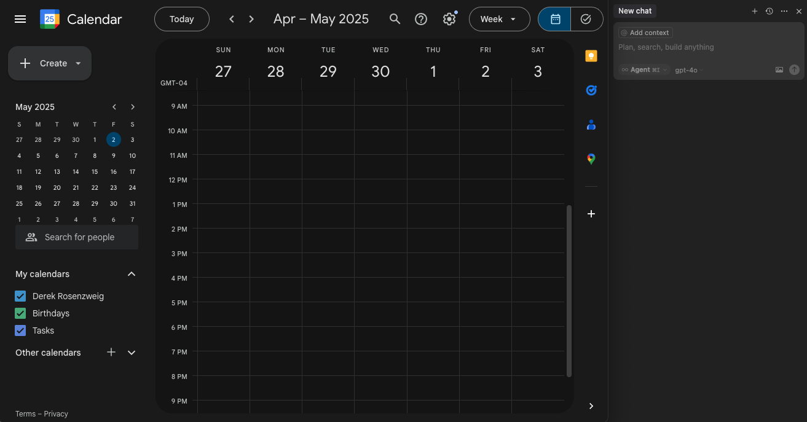

**Chronologue** is a memory-grounded planning system that integrates language models with calendar data to support personalized scheduling, reflection, and schedule-aware response and suggestions. Agents reason over structured event timelines and assist users through a familiar calendar interface. In turn, users can schedule and steer agent behavior by prompting their calendar to organize scheduled activities. 

<Info>
To get started, head to the [Quickstart Guide](/quickstart) or explore [Datasets](/examples/datasets).
</Info>

By connecting language models to calendar systems, Chronologue enables agents to:

- **Generate** calendar events from natural language memory traces (e.g., goals, reflections, observations).
- **Ground** responses and plans in real-world schedules, time constraints, and commitments.
- **Update** calendars with new structured events based on conversation context.
- **Retrieve** time-based context to improve coherence, relevance, and coordination in agent outputs.

This **bidirectional loop** ensures that both humans and agents can coordinate over time with transparency and adaptability.

---

<Accordion title="Table of Contents">
### Table of Contents

- **1. Introduction**

- **2. Core Concepts**
  - Memory Traces  
  - Calendar Integration  
  - Language Model Scheduling  
  - Editable and Promptable Interface  
  - Steerable Agents  

- **3. User Workflows**
  - Reviewing and editing past events  
  - Scheduling with memory context  
  - Weekly summaries and follow-up generation  
  - Handling missed or incomplete tasks  
  - Syncing with Google Calendar or Apple Calendar  

- **4. Agent Architecture**
  - Prompt and tool calling 
  - Event schema and trace conversion  
  - Planning and execution cycle (MCP protocol)  
  - User approval and edit layer  

- **5. System Integration**
  - `.ics` file generation and import/export  
  - Google Calendar API setup and sync  
  - iCalendar compatibility  
  - FastAPI endpoints 

- **6. Research Questions**
  - Duration estimation  
  - Tempo tokens and embeddings 
  - Memory summarization and ranking  
  - Feedback-based personalization  

- **7. Quickstart Guide**
  - Installation  
  - API keys and environment setup  
  - Running the Streamlit app  
  - Syncing your first memory trace  
</Accordion>

---

## Core Concepts

**Memory Traces**

Structured JSON records of events -- such as goals, meetings, reflections, and tasks -- used as the foundation for grounding model reasoning and informing calendar updates. 

**Calendar Integration**

Memory traces are translated into `.ics` files, enabling full synchronization with tools like Google Calendar and Apple iCalendar. 

**Language Model Scheduling**

Chronologue uses model APIs (ie. function calling) to interpret user prompts and generate structured actions -- adding, editing, deleting, summarizing, and filtering events. 

**Editable and Promptable Interface**

Users can interact through a table-based UI, chat interface, or calendar interface to make memory data: 

- **Editable** — Update, remove, or annotate memory traces (e.g., conversation history, scheduled events, reflections).
    
- **Promptable** — Ask questions or issue commands (e.g., "What did I work on last Friday?" or "What should I focus on this Friday?"), with responses grounded in past calendar data.

- **Steerable Agents**  

Chronologue enables agents that act on behalf of the user, grounded in structured memory and calendar context. The goal is to give users control over agentic behavior in time—such as scheduling deliveries, appointments, reminders, or focus blocks.

Users maintain control through:

- **Approval and editing** of any agent-generated event before it's added to the calendar.
    
- **Review of all actions** in a familiar, transparent calendar interface.
    
- **Direct prompting** of agents to take specific actions (e.g., "Plan my next study session," "Reschedule missed tasks from last week").
    
- **Orchestration over time** by embedding memory, feedback, and scheduling preferences into the planning workflow.
    
Chronologue prioritizes autonomy: agents respond to user instruction — users define the time, place, and action. 

---

## User Workflows 

**Review and Reflect**

View, filter, and annotate past memory traces and calendar events.

Example: "What were my goals last week?"

**Plan and Schedule**

Use natural language to generate new events or plans.

Example: "Schedule a 45-minute workout on Friday morning."

**Catch Up and Reschedule**

Identify incomplete tasks and reschedule them with model support.

Example: "What did I miss this week? Reschedule to next open slot."

**Summarize and Follow Up**

Generate weekly summaries and follow-up suggestions based on past actions.

Example: "Summarize my progress this week."

**Calendar Sync and Integration**

Import/export .ics files, sync with Google Calendar or iCal.

Example: Automatically push new memory-derived events into your calendar app.

📘 Cookbook of Example Prompts
Hands-on Jupyter notebook demonstrating a sample workflow and data format (event generation, rescheduling, summarization, etc.).

🖥 Streamlit App Demo
Launch the interactive interface to explore your memory traces and test agent behaviors in real time.

## Agent Architecture

Chronologue agents translate user intent into structured calendar actions using prompt-based reasoning, function calling, and memory-grounded context.

**Prompt and Tool Calling**

Chronologue uses language models (e.g., OpenAI with function calling) to interpret user prompts and generate structured commands such as add_event, edit_event, or reschedule_event. These tools enforce a controlled API for agent behavior, ensuring traceable and editable outputs.

**Event Schema and Trace Conversion**

User inputs and model outputs are structured as memory traces in a standardized JSON format. These traces include fields like:

- `type` (e.g., `calendar_event`, `goal`, `reflection`)

- `timestamp`, `title`, `content`, `duration`, `uid`

- `linked_event_uid` for event relationships

This schema enables trace-to-event conversion for `.ics` generation and calendar syncing.

**Planning and Execution Cycle (MCP Protocol)**

Chronologue implements the Model Context Protocol (MCP) to structure the flow of agent behavior:

`/context` – Retrieves relevant memory traces

`/plan` – Uses LLM to generate structured planning output

`/act` – Applies validated changes to memory or calendar state

This loop enables transparent, inspectable agent actions over time.

**User Approval and Edit Layer**

All agent-generated actions are staged for review before execution. Users can:

- Inspect and edit proposed changes in the `calendar/table` view

- Accept, modify, or reject suggestions

- Maintain full oversight over automated scheduling behavior

---
## System Integration

Chronologue bridges internal memory traces with external calendar platforms using standardized formats and API-based syncing.

**`.ics` File Generation and Import/Export**

Chronologue converts structured memory traces into `.ics` (iCalendar) files to enable:
- Exporting planned events into calendar apps
- Importing existing calendars as memory traces
- Validating and preserving event metadata (e.g., `UID`, `DTSTART`, `SUMMARY`)

**Google Calendar API Setup and Sync**

Chronologue supports bi-directional sync with Google Calendar using OAuth 2.0 and the Google Calendar API:
- Fetch user events and convert them into memory traces
- Push agent-generated events directly into Google Calendar
- Maintain event UID consistency for future updates or deletions

Requires setup of:
- `credentials.json` and `token.json` for authentication
- Scoped access for `calendar.readonly` and `calendar.events`

**iCalendar Compatibility**

Generated `.ics` files are fully compatible with:
- Apple Calendar (macOS and iOS)
- Outlook and other `.ics`-compliant applications

This ensures that even non-Google users can benefit from Chronologue's memory-based scheduling features.

**FastAPI Endpoints**

Chronologue exposes a structured API for interaction with agents and external systems:

- `GET /context`  
  Return a filtered set of memory traces relevant to a given time range or query.

- `POST /plan`  
  Accept a prompt and memory context, returning a structured plan (e.g., proposed events).

- `POST /act`  
  Commit changes to the memory trace store or calendar state based on approved agent actions.

These endpoints power the MCP (Model Context Protocol) loop and can be called from external interfaces, including the Streamlit app and CLI tools.

---

## Research Questions 

<AccordionGroup>

<Accordion title="Duration Estimation">

How accurately can language models estimate how long a user-specific task will take?

- Explore conditional duration modeling based on user feedback, history, and task type  
- Evaluate grounded time distributions (mean, variance, confidence intervals)  
- Use these estimates to improve calendar slot suggestions and adaptive scheduling

</Accordion>

<Accordion title="Tempo Tokens and Embeddings">

How should structured memory traces (e.g., JSON event logs) be serialized and embedded to preserve temporal and semantic structure?

- Design temporal tokens (e.g., `<tempo:2024-05-08T09:00Z>`) for model prompts  
- Explore serialization strategies that retain time order and task dependencies  
- Analyze effects on grounding fidelity, coherence, and chronological reasoning

</Accordion>

<Accordion title="Memory Summarization and Ranking">

What are effective strategies for compressing or prioritizing long-term memory traces for in-context planning?

- Compare extractive, abstractive, and mixed summarization techniques  
- Develop retrieval and ranking methods based on time relevance, recurrence, or user feedback  
- Align summarization granularity with planning horizon

</Accordion>

<Accordion title="Personalization and Feedback">

How can agent behavior improve over time based on explicit and implicit user feedback?

- Track edits, approvals, rejections, and timing behavior to learn user preferences  
- Adapt scheduling suggestions and memory retrieval dynamically

</Accordion>

</AccordionGroup>
